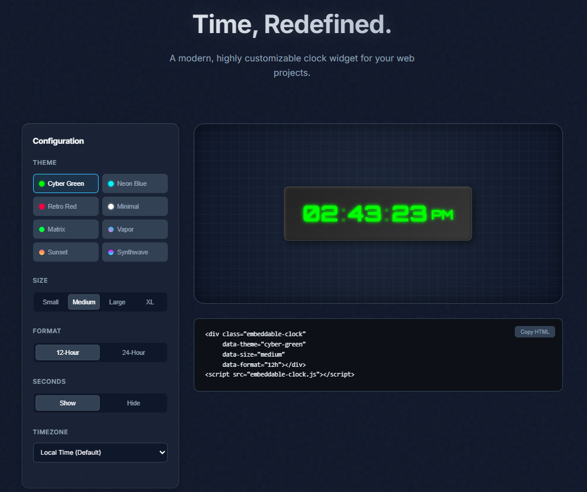

# Embeddable Clock Widget

A modern, customizable clock widget that can be embedded into any webpage. Features smooth animations, multiple themes, and various display options.

<p align="center">
  
</p>

## Features

- 8 Beautiful Themes:
  - Cyber Green (default): Futuristic green glow with dark gradient background
  - Neon Blue: Electric blue digits with deep space background
  - Retro Red: Warm red glow with dark contrast
  - Minimal White: Clean white design with subtle shadows
  - Matrix: Digital rain effect with bright green text
  - Vapor Wave: Pink and purple gradient with retro grid pattern
  - Sunset: Warm gradient background with pulsing glow
  - Synthwave: Perspective grid with neon pink and cyan accents
- Multiple sizes (small, medium, large, extra-large)
- 12/24 hour time formats
- Timezone support (IANA timezones)
- Smooth digit transitions and animations
- Accessible (ARIA support)
- Responsive design

## How to Use

Add this to your HTML:

```html
<div class="embeddable-clock"></div>
<script src="embeddable-clock.js"></script>
```

(You can also use `id="clock-widget-target"` for legacy support).

## Customization Options

### Themes
```html
data-theme="theme-name"
```
Available themes:
- `cyber-green`
- `neon-blue`
- `retro-red`
- `minimal-white`
- `matrix`
- `vapor-wave`
- `sunset`
- `synthwave`

### Time Format
```html
data-format="format"
```
Options:
- `12h` (default) - 12-hour format with AM/PM
- `24h` - 24-hour military time format

### Show/Hide Seconds
```html
data-show-seconds="true|false"
```
- `true` (default) - Shows hours, minutes, and seconds
- `false` - Shows only hours and minutes

### Size
```html
data-size="size"
```
Available sizes:
- `small` (1.5rem)
- `medium` (3rem, default)
- `large` (4rem)
- `extra-large` (5rem)

### Timezone
```html
data-timezone="Zone/City"
```
Use any valid IANA timezone string.
Examples:
- `America/New_York`
- `Europe/London`
- `Asia/Tokyo`
- `UTC`

If omitted or invalid, defaults to the user's local time.

## Advanced Styling (CSS Variables)

You can customize the look completely using CSS variables in your own stylesheet:

```css
.clock-widget {
  --ec-color: #ff0000; /* Text Color */
  --ec-bg: #000000;    /* Background */
  --ec-border-color: #333;
  --ec-text-shadow: 0 0 10px red;
  --ec-font-family: 'Courier New', monospace;
}
```

## Example with All Options

```html
<div class="embeddable-clock"
     data-theme="neon-blue"
     data-format="24h"
     data-show-seconds="false"
     data-size="large"
     data-timezone="America/New_York">
</div>
```

## Live Configurator

Visit our [interactive configurator](https://TMHSDigital.github.io/clock-v1/) to:
- **Design your clock**: Tweak themes, sizes, and formats in real-time.
- **Copy & Paste**: Get the exact embed code for your customized widget.
- **Modern UI**: Experience the new split-screen design with responsive previews.

## Development

- `index.html`: Modern configurator UI for generating embed codes.
- `embeddable-clock.js`: Core widget code with themes and animations.

## Technical Details

- Uses the Orbitron font for that perfect digital display look
- Precision timing engine (self-correcting to 0ms offset)
- Internationalization API for robust time handling
- Accessible via ARIA roles and labels
- No external dependencies
- Lightweight and performance-optimized
